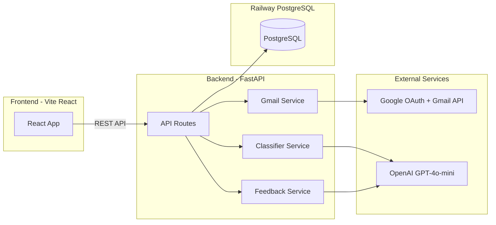
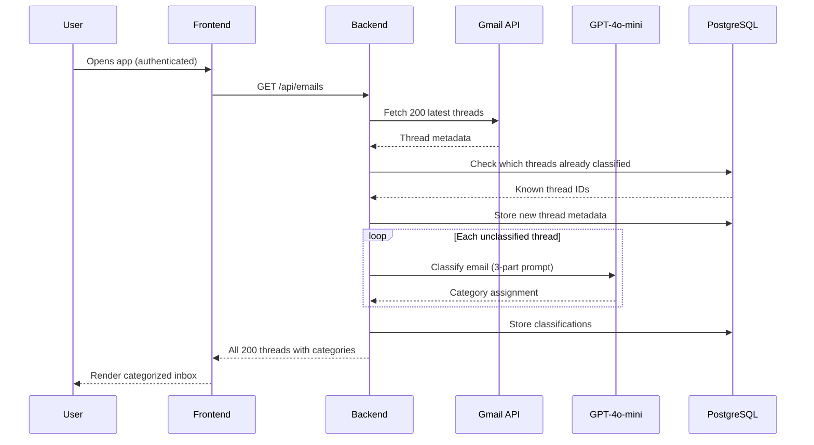

# Inbox Concierge — Product Requirements Document

## 1. Overview

Inbox Concierge is a web application that authenticates a user's Google account, fetches their last 200 Gmail threads, and classifies them into configurable buckets using an LLM-powered pipeline. Users can create custom categories, drag emails between categories to correct classifications, and the system learns from this feedback to improve future classifications.

---

## 2. Tech Stack

- **Frontend**: Vite 7 + React 19 + TypeScript
- **Styling**: CSS Modules, monochrome flat design, Gmail-inspired
- **State Management**: React Context API
- **Drag & Drop**: `@dnd-kit/react` (new architecture, built on `@dnd-kit/dom`)
- **Backend**: Python 3.13 + FastAPI 0.135
- **ORM**: SQLAlchemy 2.0 + Alembic (migrations)
- **Database**: PostgreSQL
- **LLM**: OpenAI GPT-4o-mini
- **Gmail Integration**: Google OAuth 2.0 + Gmail API (readonly)
- **Auth Tokens**: PyJWT for sessions, Fernet encryption for stored Google tokens
- **Deployment**: Railway (frontend, backend, and Postgres all in one project)

### Key Dependencies

**Backend** (`requirements.txt`):

- `fastapi`, `uvicorn[standard]`
- `sqlalchemy[asyncio]`, `asyncpg`, `alembic`
- `openai`
- `google-auth`, `google-auth-oauthlib`, `google-api-python-client`
- `pyjwt`, `cryptography`
- `pydantic-settings`, `python-dotenv`

**Frontend** (`package.json`):

- `react`, `react-dom`, `react-router-dom`
- `@dnd-kit/react`, `@dnd-kit/dom`
- `date-fns`

---

## 3. Architecture



### Data Flow — Initial Load



---

## 4. Database Schema

### `users`

| Column | Type | Notes |
|--------|------|-------|
| `id` | UUID | PK |
| `google_id` | VARCHAR | UNIQUE NOT NULL |
| `email` | VARCHAR | NOT NULL |
| `name` | VARCHAR | |
| `access_token` | TEXT | Fernet-encrypted |
| `refresh_token` | TEXT | Fernet-encrypted |
| `token_expiry` | TIMESTAMP | |
| `prompt_notes` | TEXT | User-specific notes section, starts NULL |
| `created_at` | TIMESTAMP | |
| `updated_at` | TIMESTAMP | |

### `categories`

| Column | Type | Notes |
|--------|------|-------|
| `id` | UUID | PK |
| `user_id` | UUID | FK → users.id |
| `name` | VARCHAR | NOT NULL |
| `description` | TEXT | Optional, used in prompt |
| `created_at` | TIMESTAMP | |

- Unique constraint on `(user_id, name)`
- Displayed in alphabetical order (no display_order column)
- Default categories defined as a Python constant (`DEFAULT_CATEGORIES` in `app/constants.py`)
- "Reset to Defaults" deletes all user categories and classifications, re-seeds from constant

### `email_threads`

| Column | Type | Notes |
|--------|------|-------|
| `id` | UUID | PK |
| `user_id` | UUID | FK → users.id |
| `gmail_thread_id` | VARCHAR | NOT NULL |
| `gmail_message_id` | VARCHAR | Latest message ID, for linking |
| `subject` | VARCHAR | |
| `sender` | VARCHAR | |
| `snippet` | TEXT | |
| `date` | TIMESTAMP | |
| `created_at` | TIMESTAMP | |

- Unique constraint on `(user_id, gmail_thread_id)`

### `classifications`

| Column | Type | Notes |
|--------|------|-------|
| `id` | UUID | PK |
| `email_thread_id` | UUID | FK → email_threads.id |
| `category_id` | UUID | FK → categories.id |
| `is_user_corrected` | BOOLEAN | DEFAULT FALSE |
| `classified_at` | TIMESTAMP | |

- Unique constraint on `(email_thread_id)` — one classification per thread

---

## 5. Default Categories

Seeded for every new user on first login:

1. **Important** — Urgent emails requiring immediate attention or action
2. **Actionable** — Needs a response or follow-up but not time-sensitive
3. **FYI** — Informational, worth reading, no action needed
4. **Newsletter** — Newsletters and subscription content
5. **Marketing** — Promotional emails, deals, advertisements
6. **Auto-archive** — Automated notifications, receipts, confirmations, safe to ignore

---

## 6. Authentication Flow

**Scope**: `https://www.googleapis.com/auth/gmail.readonly`

1. User clicks "Sign in with Google" on the frontend
2. Frontend redirects to `GET /api/auth/login` on the backend
3. Backend constructs Google OAuth URL and redirects user to Google consent screen
4. User grants Gmail read access
5. Google redirects to `GET /api/auth/callback` with an authorization code
6. Backend exchanges code for access_token + refresh_token
7. Backend creates or updates user record in DB (encrypts tokens with Fernet)
8. Backend creates default categories if new user
9. Backend issues a JWT session token
10. Backend redirects to frontend with JWT as a query parameter
11. Frontend stores JWT in memory (React Context) and uses it for all API calls via `Authorization: Bearer <token>` header

**Token Refresh**: When the Gmail access token expires, the backend uses the stored refresh token to obtain a new one transparently.

---

## 7. Core Features

### 7.1 Email Fetching & Caching

- Backend fetches the 200 most recent threads via `users.threads.list` with `maxResults=200`
- For each thread, fetch metadata via `users.threads.get` with `format=metadata` (subject, from, date) plus the snippet
- Store thread metadata in `email_threads` table
- On subsequent visits: fetch latest 200 thread IDs from Gmail, compare with DB, only process new/unseen threads
- Gmail link format: `https://mail.google.com/mail/u/0/#inbox/{gmail_thread_id}`

### 7.2 Open in Gmail

- Each email item displays an "Open in Gmail" button/icon
- Clicking opens the thread in the user's Gmail in a new tab
- No in-app email detail view for MVP (stretch goal)

### 7.3 Classification Pipeline

**Abstraction**: The classifier is a clean, isolated module with a simple interface:

```python
async def classify_email(
    email: EmailThread,
    categories: list[Category],
    user_notes: str | None,
) -> str:
    """Returns the name of the assigned category."""
```

**Orchestration**: A loop that classifies each email individually with concurrency control:

```python
async def classify_emails(
    emails: list[EmailThread],
    categories: list[Category],
    user_notes: str | None,
    max_concurrent: int = 20,
) -> dict[str, str]:
    """Returns mapping of thread_id -> category_name."""
```

Uses `asyncio.Semaphore` to limit concurrent OpenAI calls to ~20.

**3-Part Prompt Structure** (see Section 8):

1. System instructions (universal)
2. Categories + descriptions (user-specific)
3. Notes from feedback learning (user-specific, initially empty)

### 7.4 Custom Categories

- "Manage Categories" button at the bottom of the sidebar opens a modal
- **Modal contents:**
  - List of current categories with name and description
  - Inline edit: click a category name or description to edit in-place
  - Delete button (trash icon) per category
  - "Add Category" form at the bottom: name field + optional description + add button
  - "Reset to Defaults" button
  - "Save & Close" button
- Categories always displayed alphabetically in the sidebar
- **On save with changes**: all classifications deleted and full reclassification triggered
- Loading state with progress indicator during reclassification

### 7.5 Drag & Drop Reclassification

- Each email item is draggable (`@dnd-kit` draggable)
- Each category tab in the sidebar is a drop target (`@dnd-kit` droppable)
- On drop to a different tab:
  1. **Optimistic UI**: email immediately moves to new category
  2. **API call**: `PATCH /api/classifications/{id}` with `{ category_id: newCategoryId }`
  3. **Backend**: updates classification, sets `is_user_corrected = true`
  4. **Feedback**: backend asynchronously kicks off feedback learning
  5. **Error handling**: revert optimistic update on failure, show error toast

### 7.6 Feedback Learning System

When a user corrects a classification:

1. Backend receives the correction (old category, new category, email context)
2. Backend calls the LLM with a feedback prompt including the email details, old/new category, and current `prompt_notes`
3. LLM returns updated notes incorporating the lesson
4. Backend replaces `prompt_notes` in the DB
5. All future classifications use updated notes

Runs asynchronously (fire-and-forget). The user doesn't wait for it.

---

## 8. Prompt Design

### Classification Prompt

```
System:
You are an email classification assistant. You will be given an email thread's
metadata and must classify it into exactly one of the provided categories.
Respond with ONLY the category name, nothing else.

User:
## Categories
{for each category}
- {name}: {description}
{end for}

## User Preferences
{user_notes or "No specific preferences yet."}

## Email
Subject: {subject}
From: {sender}
Preview: {snippet}
Date: {date}

Classify this email into one of the categories above.
```

### Feedback Learning Prompt

```
System:
You help refine email classification rules for a specific user. Based on a
correction the user made, update their preference notes to improve future
classifications. Keep notes concise (max 10 bullet points). Return ONLY the
updated notes as a bullet list.

User:
The user moved an email from "{old_category}" to "{new_category}".

Email details:
- Subject: {subject}
- From: {sender}
- Preview: {snippet}

Current user preference notes:
{current_notes or "None yet."}

Based on this correction, generate updated preference notes that would help
classify similar emails correctly in the future. Consolidate related rules.
If notes exceed 10 bullets, merge or remove the least important ones.
```

---

## 9. API Endpoints

### Auth

| Method | Path | Description |
|--------|------|-------------|
| GET | `/api/auth/login` | Redirects to Google OAuth consent screen |
| GET | `/api/auth/callback` | OAuth callback, exchanges code for tokens, returns JWT |
| GET | `/api/auth/me` | Returns current user info |
| POST | `/api/auth/logout` | Invalidates session |

### Emails

| Method | Path | Description |
|--------|------|-------------|
| GET | `/api/emails` | Fetch and classify user's threads (returns all 200 with categories) |

### Categories

| Method | Path | Description |
|--------|------|-------------|
| GET | `/api/categories` | List user's categories (alphabetical) |
| PUT | `/api/categories` | Bulk update categories from modal; triggers reclassification if changed |
| POST | `/api/categories/reset` | Reset to default categories; triggers reclassification |

### Classifications

| Method | Path | Description |
|--------|------|-------------|
| PATCH | `/api/classifications/{id}` | Update classification (drag-and-drop); triggers feedback learning |

---

## 10. UI Design

The entire UI takes strong inspiration from Gmail's layout and aesthetic, adapted to a monochrome palette.

### Layout

```
+----------------------------------------------------------+
| Inbox Concierge                    user@email [Sign Out]  |
+------------+---------------------------------------------+
|            |                                              |
|  Important |  Subject line of email thread...             |
|    (12)    |  sender@example.com — preview snippet...     |
|            |  Mar 5, 2026                         [Open]  |
|  Actionable|                                              |
|    (8)     |  Another email subject line...               |
|            |  other@example.com — snippet text here...     |
|  FYI (34)  |  Mar 4, 2026                         [Open]  |
|            |                                              |
|  Newsletter|  ...                                         |
|    (15)    |                                              |
|            |                                              |
|  Marketing |                                              |
|    (22)    |                                              |
|            |                                              |
|  Auto-     |                                              |
|  archive   |                                              |
|    (109)   |                                              |
|            |                                              |
| [Manage    |                                              |
|  Categories]                                              |
+------------+---------------------------------------------+
```

### Gmail-Inspired Design Principles

- **Monochrome palette**: Background `#F6F8FC`, surface `#FFFFFF`, borders `#E0E0E0`, primary text `#202124`, secondary text `#5F6368`, active tab `#E8E8E8`
- **Flat design**: No shadows except subtle one on nav bar; clean 1px borders
- **Rounded borders**: `8px` on cards/modals, `16px` on buttons (pill-shaped)
- **Typography**: System font stack (`-apple-system, BlinkMacSystemFont, "Segoe UI", sans-serif`)
- **Gmail-style sidebar**: Category labels stacked vertically, active label has rounded pill highlight, email count in parentheses
- **Gmail-style email rows**: Full-width, subtle hover highlight (`#F2F2F2`), horizontal dividers, "Open in Gmail" icon appears on hover
- **Responsive**: Sidebar collapses on smaller screens (stretch goal)

### Category Management Modal

- Triggered by "Manage Categories" button at bottom of sidebar
- Clean centered modal with backdrop, `max-width: 480px`
- Each category row: editable name input, editable description input, delete icon
- "Add Category" section at bottom with input fields and "Add" button
- Footer: "Reset to Defaults" link on left, "Cancel" and "Save" buttons on right
- On save with changes: modal closes, loading overlay during reclassification

### Drag & Drop UX

- Dragging an email shows a drag preview with subject line
- Category tabs highlight when a draggable hovers over them
- Smooth transition animation on drop
- Count updates optimistically on target tab

### Loading States

- Initial load: skeleton placeholders in email list
- Reclassification: overlay with spinner and progress message
- Drag-and-drop: optimistic updates, revert on error with toast

---

## 11. MVP Scope & Iteration Strategy

### MVP — Target for submission

- Google OAuth + Gmail read access
- Fetch and display 200 threads with subject, sender, date, snippet
- LLM classification into default categories
- Gmail-inspired sidebar with category tabs (alphabetical, with counts)
- "Open in Gmail" button per email
- Category management modal (add, edit, delete, reset to defaults)
- Reclassification on category changes
- Drag-and-drop reclassification with optimistic UI
- Feedback learning (prompt notes section updates)
- Caching: only classify unclassified threads
- Deployed on Railway


### Abstraction Points (designed for easy iteration)

- `classify_email()`: can swap from individual to batch, change model, change prompt
- Prompt templates: stored as constants, easy to modify
- `feedback_learn()`: can change learning strategy without touching other code
- Gmail service: isolated in `gmail.py`, easy to mock for testing
